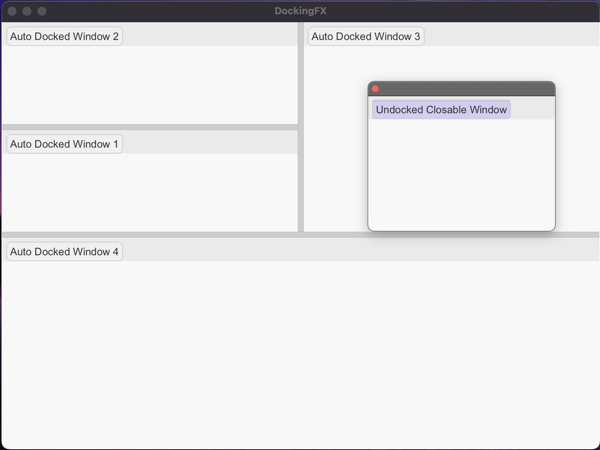

# Docking-FX

**DockingFX** is a simple JavaFX application that demonstrates docking window management using the `Docker` and `DWindow` classes. It allows you to easily create windows that can be docked to the edges of a parent window or undocked, providing a flexible UI structure.




## Features

- **Dockable Windows**: Windows can be docked to the left, top, right, or bottom of the main window.
- **Undocked Windows**: Windows can be undocked and closed independently.
- **Customizable Themes**: Choose between a light or dark theme for the UI.
- **Event Handling**: Set custom actions for window close events.

## How It Works

### Main Components

- **Docker**: The main container that holds the dockable windows and handles the layout and interaction.
- **DWindow**: Individual windows that can be docked or undocked.

### Key Functionalities

1. **Dock Positioning**: Windows can be positioned to any edge or undocked.
2. **Window Closure**: You can configure whether a window should dock again when closed or remain undocked.
3. **CSS Styling**: The application allows you to switch between a light or dark theme using CSS.

## Example

### Create Dockable Windows

You can create dockable windows by calling the `createDWindow` method on the `Docker` instance:

```java
Docker docker = new Docker(primaryStage);

DWindow docker.createDWindow(
  ExampleStringProperty("Example Window"),  // -> This is the string that will show on the window tab
  ExampleNodeContent,                       // -> This is the main content node for your tab
  Docker.DockPosition.None                  // -> This is the enum that shows the original dock position to the docker.
                                            //    There are in total 5 choices:
                                            //     - Left, Right, Top, Bottom: Initially dock to the corresponding
                                            //                                 position of the main window.
                                            //     - None: Will NOT dock in the initial state.
);
```

### Window Configuration

You can configure the behavior of a window when it is closed by setting the `dockOnClose` property and handling the `onClose` event:

```java

dockingWindow1.setDockOnClose(true);        // Automatically docks when closed
dockingWindow2.setDockOnClose(false);       // Does not dock when closed
dockingWindow2.setOnClose(event -> {
  System.out.println("Window 2 closed.");
});

```

### UI Theme

You can switch between light and dark themes by adding the appropriate CSS file:

```java
docker.addStyleSheet(DOCKER_STYLE_LIGHT_CSS);   // Light theme
```

```java
docker.addStyleSheet(DOCKER_STYLE_DARK_CSS);    // Dark theme
```

```java
docker.addStyleSheet(YOUR_CUSTOM_STYLE_CSS);    // Your custom theme
```

## Dependencies

- Java >= 9
- JavaFX 11

## Notes
The `Docker` and `DWindow` classes provide a basic implementation of docking window management. You can extend and customize these classes to suit your specific requirements.
